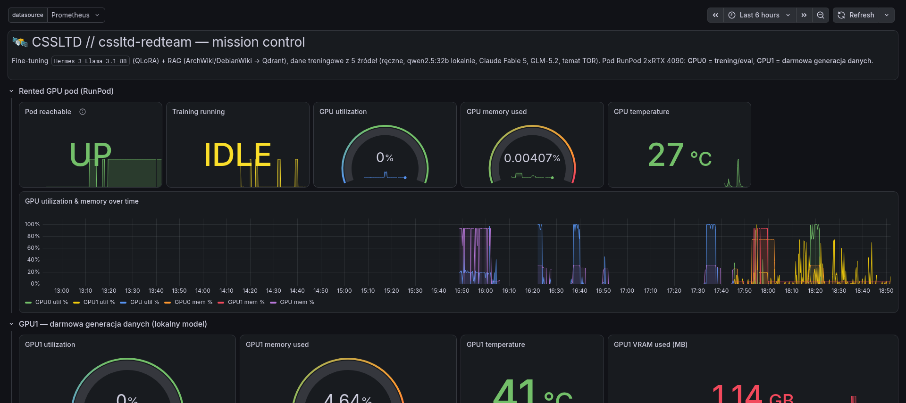
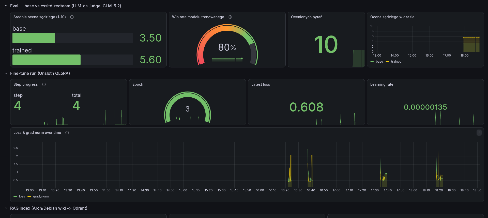
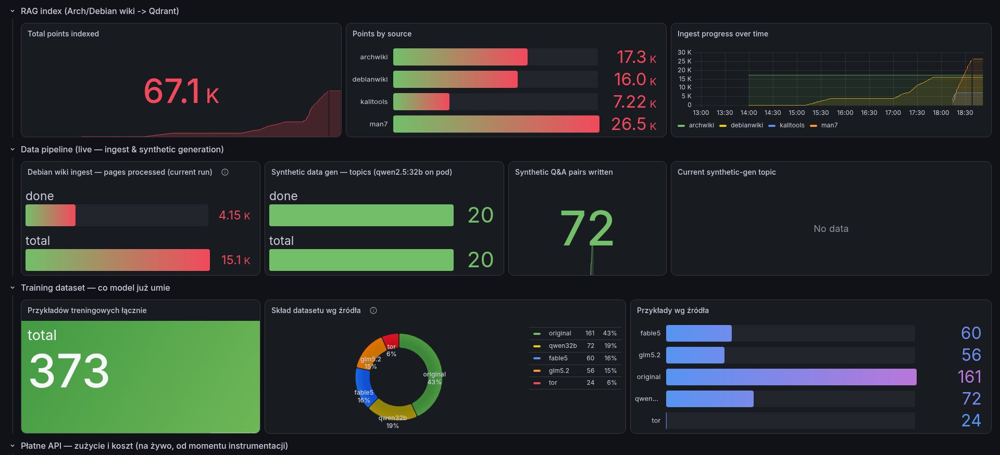

# 🛡️ CSSLTD AI Red Team — nothing sensitive ever leaves the perimeter

**Frontier-AI-assisted penetration testing, engineered so client data never reaches a third-party model unredacted.**

👉 **[Read the full briefing](https://zi3lak.github.io/cssltd-ai-redteam/)**

---

## 🎯 What this actually is

Two systems, built together, deployed together:

- 🔒 **CSS Privacy Gateway** — a de-identifying reverse proxy that sits between your team and any external LLM. Secrets get stripped irreversibly. Client names, hosts, and domains get pseudonymised outbound and restored inbound. The provider only ever sees an anonymous origin.
- 🤖 **cssltd-redteam** — a model fine-tuned specifically on red-team methodology and CSSLTD's own report style, running entirely on infrastructure we control. For the routine 80% of questions, nothing needs to leave the room at all.

Together: your team gets AI-accelerated pentesting *without* the compliance exposure that comes from pasting client infrastructure into a public chatbot.

**Neither system is a one-time snapshot.** The knowledge base behind cssltd-redteam is re-ingested and re-indexed on an ongoing basis, and every release gets re-benchmarked against the base model before it ships — the numbers below move because the underlying system keeps running, not because we refreshed a screenshot.

## 📡 Live from the build — real Grafana, not mockups

No stock dashboards, no fake metrics — these are screenshots of the actual monitoring stack watching the actual training run, taken straight off our Grafana instance.

**Mission control** — pod status, dual-GPU utilisation over time, both cards driven by live Prometheus scrapes:

**Judge says it's working** — an independent model (GLM-5.2) blind-scores base vs. fine-tuned on the same questions, every release. 80% win rate, not a vibe:

**The knowledge base, growing live** — 67K+ vectors indexed across four technical corpora, dataset composition tracked by source down to the example:

## 📊 The numbers (pulled from the live build)

| | |
|---|---|
| 🧰 **772** | Kali Linux tools indexed with real usage examples, not summarised |
| 📖 **3,000+** | Linux manual pages — user commands & sysadmin reference |
| 🗂️ **4** | independent technical corpora feeding retrieval, continuously updated |
| ⚖️ **80%** | win rate vs. the base model, scored by an independent judge model on every release |
| 🕳️ **0** | engagement identifiers ever stored by an external model provider |
| 📡 **Live** | knowledge base and benchmark both re-verified continuously — watch it move on the dashboard above, not a static screenshot |

## 🇬🇧 Built for UK engagements

- Aligned with **UK GDPR / Data Protection Act 2018** data-minimisation principles — pseudonymise *before* transmission, not after a breach.
- Architecture follows **NCSC** guidance on safe adoption of AI tooling: least data, least trust, full audit trail.
- On-premise / air-gapped deployment available for engagements that can't touch third-party infrastructure at all.

## 🔐 What you won't find in this repo

The redaction engine, the fine-tuning pipeline, the RAG ingestion, and the model weights are **CyberSentinel Solutions Ltd's own IP** — not published here. This repo is the pitch, not the recipe. If that's the kind of edge you want in your own shop, get in touch.

## 📬 Want this in your pipeline?

**support@cybersentinelsolutionsltd.co.uk** — 15 minutes, we show the redaction pipeline live on a prompt you write.

---

CyberSentinel Solutions Ltd · UK
